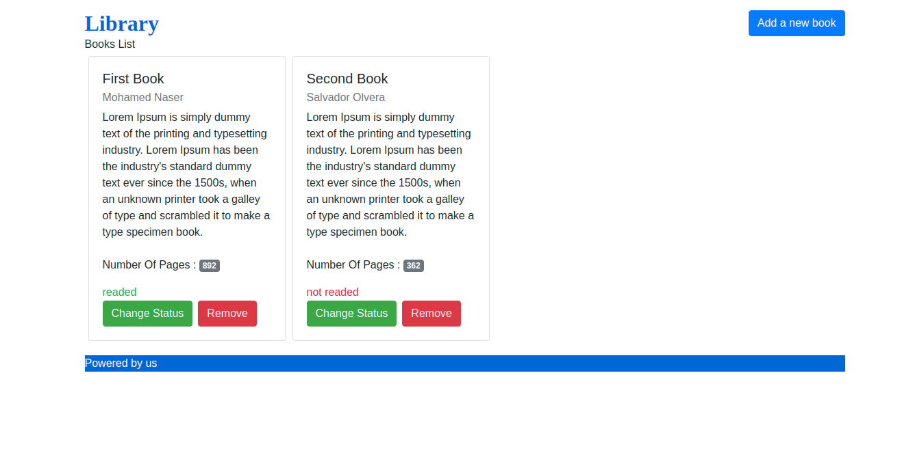
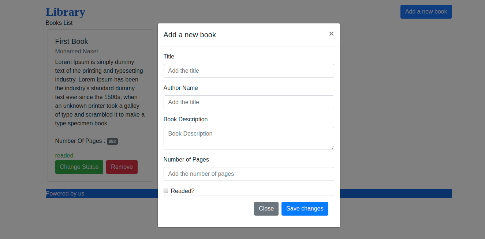

# Simple Library with Firebase

This website is a part of the odein project course to practice with js and firebase.

[Click To Check The Project Details](https://www.theodinproject.com/courses/javascript/lessons/library)

## Authors

This project was executed by the duo of :

- [Mohamed Naser](https://www.linkedin.com/in/mohamednaseramein/)
- [Salvador Olvera](https://www.linkedin.com/in/salvador-olvera-n)

## Used Tools

- HTML
- CSS
- Firebase
- MarkDown Syntax

## Done Work

- [x] List predefined books .
- [x] Add your favorite book.
- [x] delete any book.
- [x] change read status for any book.
- [x] do any action in realtime you don't need to refresh the page.

## Setup

Open your git bash and cd to the location you'd like to put your files the run the command below.

```console
git clone https://github.com/mohamednaser/library.git
```

## Live Version

Live version [here](https://mohamednaser.github.io/library/).

## ScreenShots



